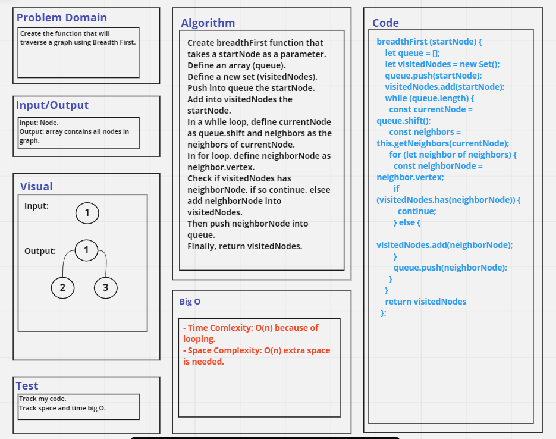

# Challenge Summary
Create the function that will traverse a graph using Breadth First.

## Whiteboard Process

## Approach & Efficiency
- Time Comlexity: O(n) because of looping.
- Space Complexity: O(n) extra space is needed.

## Solution
See [graph.test file](./__tests__/graph.test.js).