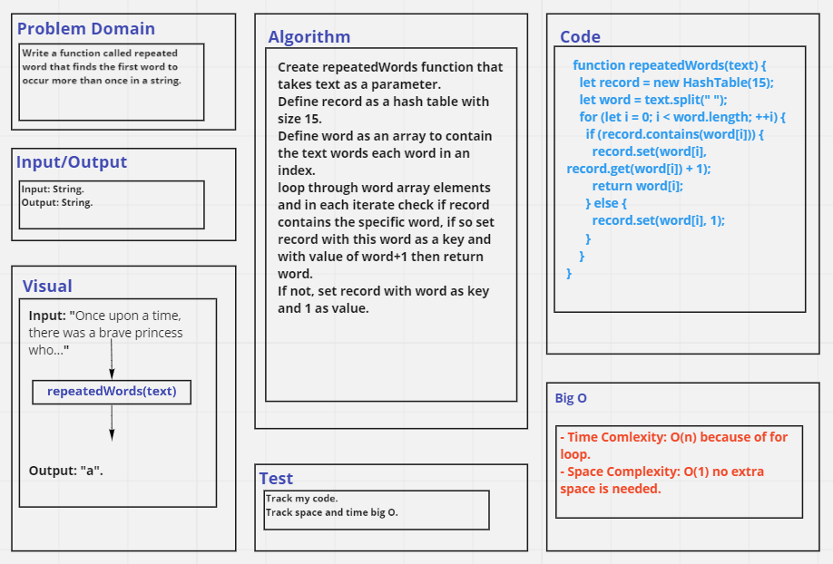

# Challenge Summary
Write a function called repeated word that finds the first word to occur more than once in a string.

- Arguments: string.
- Return: string.

## Whiteboard Process

## Approach & Efficiency
- Time Comlexity: O(n) because of for loop.
- Space Complexity: O(1) no extra space is needed.

## Solution
See [hashtables.test file](./__tests__/hashtables.test.js).