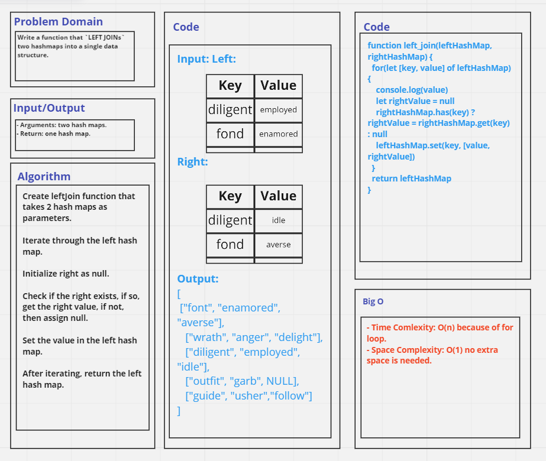

# Challenge Summary
Write a function that `LEFT JOINs` two hashmaps into a single data structure.

- Arguments: two hash maps.
- Return: one hash map.

## Whiteboard Process

## Approach & Efficiency
- Time Comlexity: O(n) because of for loop.
- Space Complexity: O(1) no extra space is needed.

## Solution
See [hashtables.test file](./__tests__/hashtables.test.js).