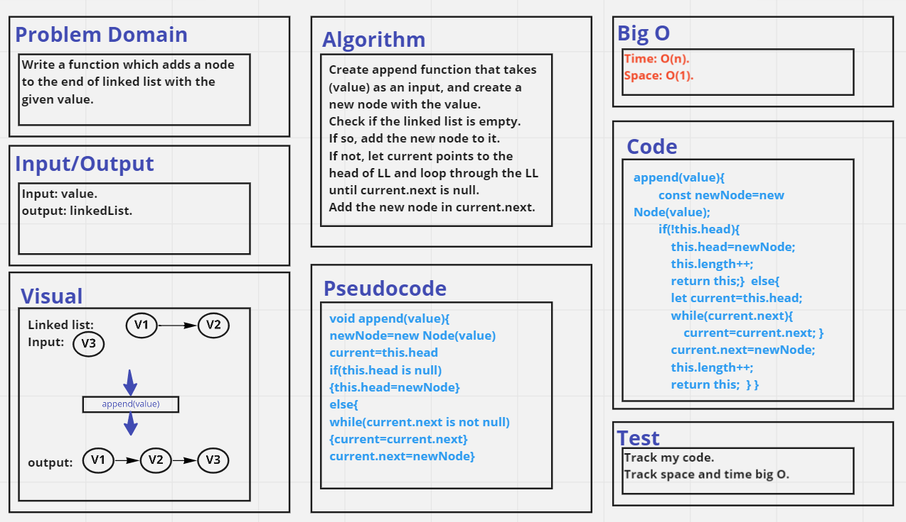
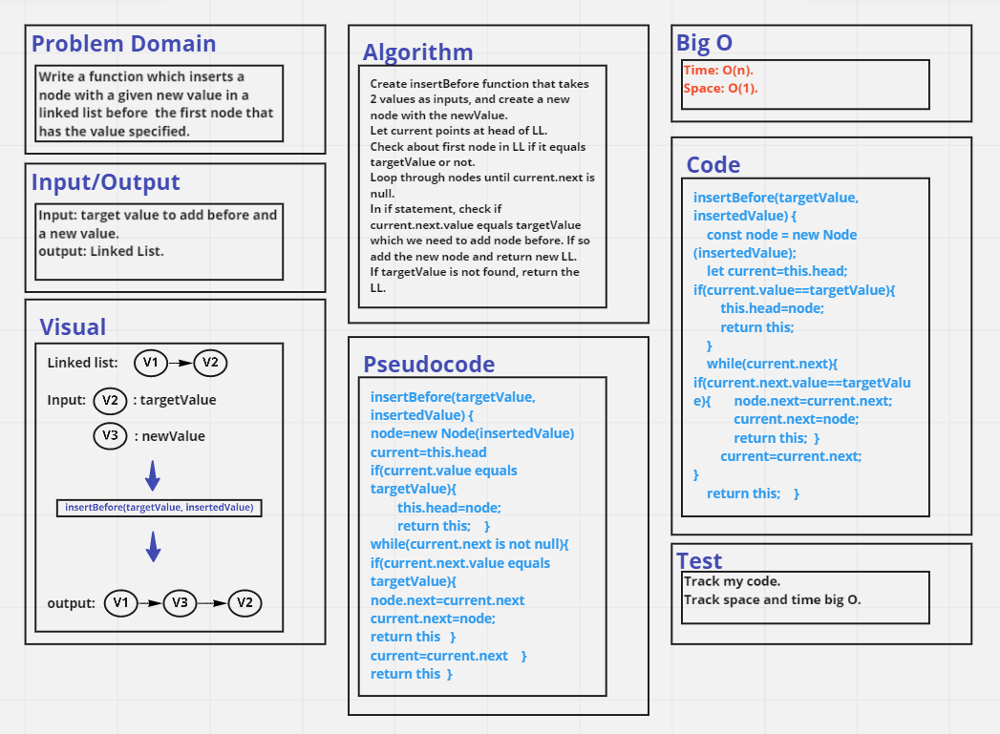
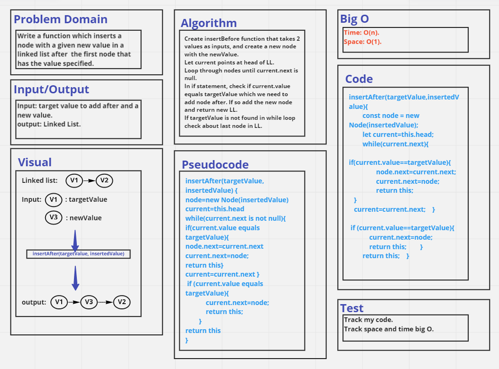
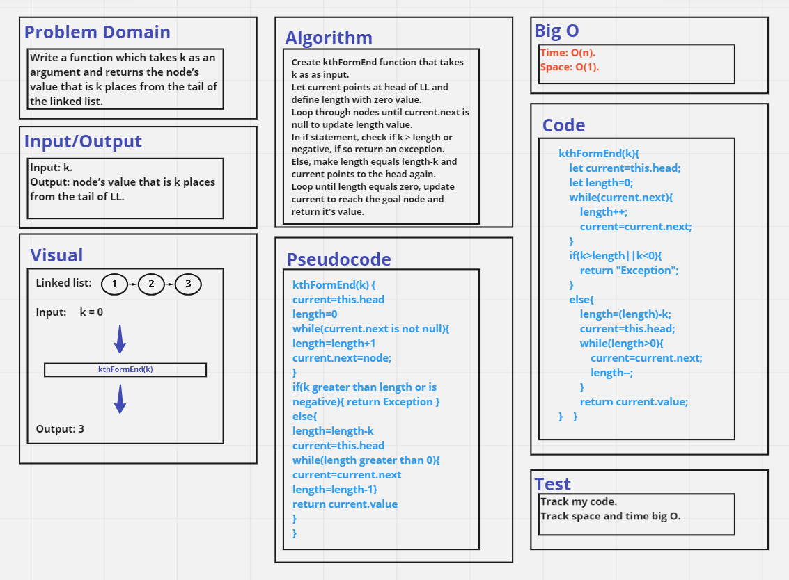
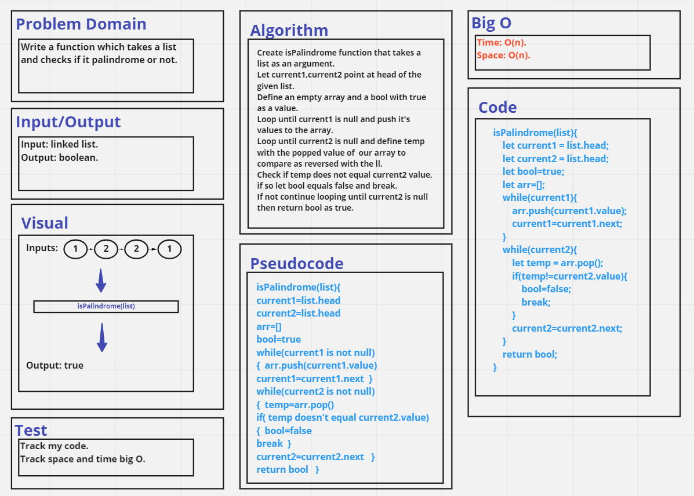

# Linked-List Insertions 
Implementation of some linked list insertion functions:

## Whiteboard Process

- `append(value)`
.

- `insertBefore(targetValue, insertedValue)`
.

- `insertAfter(targetValue, insertedValue)`
.

- `kthFormEnd(k)`
.

- `zipLists(list1,list2)`
.

- `isPalindrome(list)`

## Approach & Efficiency
In each one of mentioned functions the worst case was to loop through linked list elements, so I used (while) approach and have an O(n) as time complexity.
In first five functions I have an O(1) as space complexity because there is no need to additional space.
But in `isPalindrome(list)` function I needed to use an temporary array so tha space complexity was O(n).