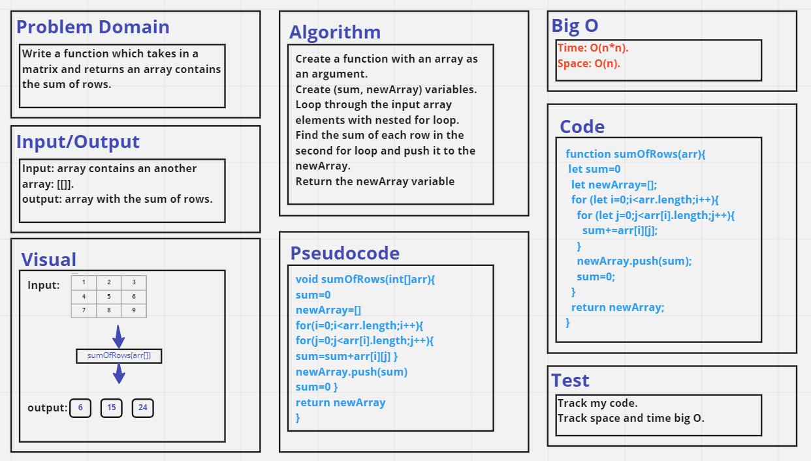

# Matrix
Write a function which takes in a matrix and returns an array contains the sum of rows.

## Whiteboard Process

.

## Approach & Efficiency
 I used nested loop approach, it has a O(n*n) as time complexity and O(n) as space complexity. 