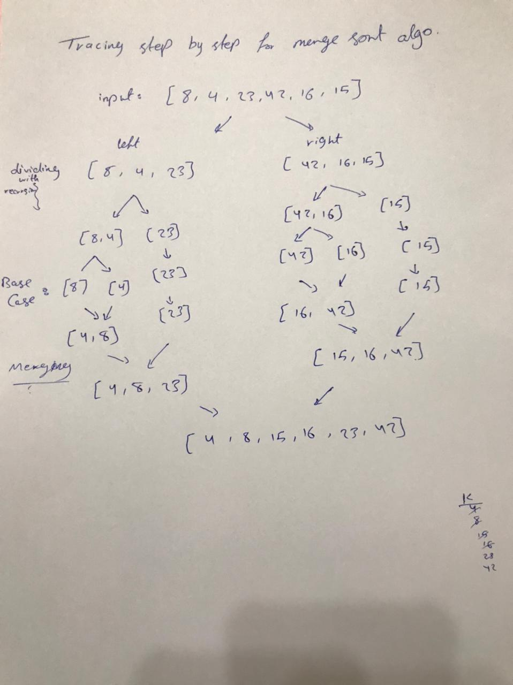

# Blog

**Merge sort** algorithm is a sorting algorithm that is considered an example of the divide and conquer strategy. So, in this algorithm, the array is initially divided into two equal halves and then they are combined in a sorted manner.   

[Home](./README.md)