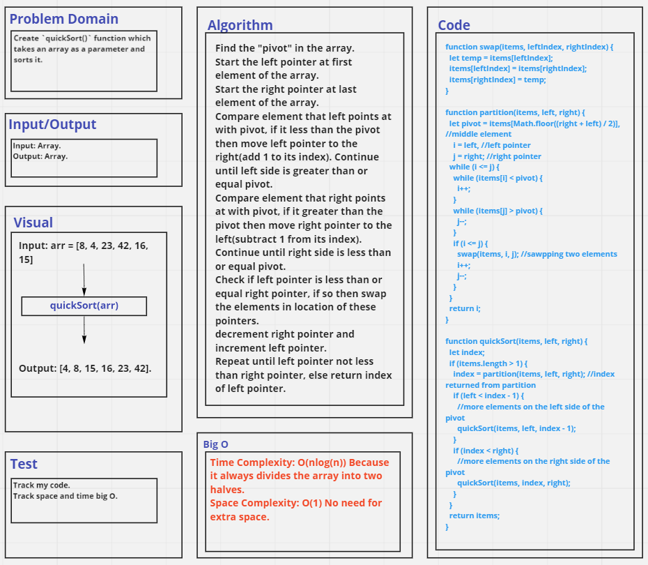

# Challenge Summary
Trace the algorithm by stepping through the process with the provided sample array. Document your explanation by creating a blog article that shows the step-by-step output after each iteration through some sort of visual.

Once you are done with your article, code a working, tested implementation of Quick Sort based on the pseudocode provided.

## Whiteboard Process

## Approach & Efficiency
- Time Complexity: O(nlog(n)) Because it always divides the array into two halves.
- Space Complexity: O(1) No need for extra space.

## Solution
See [quick-sort.test](./__tests__/quick-sort.test.js) file.

See [Blog File](./BLOG.md)