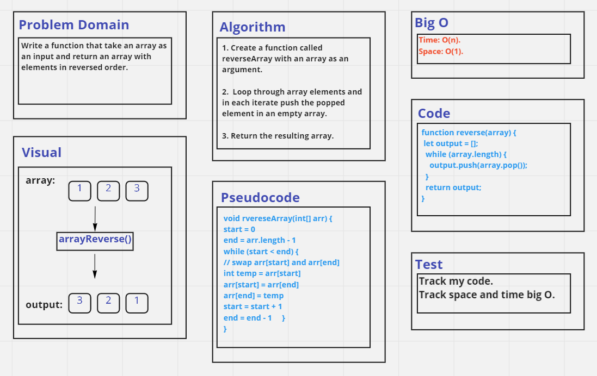

# Reverse Array 

Write a function that take an array as an input and return an array with elements in reversed order.

## Whiteboard Process

.

## Approach & Efficiency
 I used loop approach (while), it has a O(n) as time complexity and O(1) as space complexity.