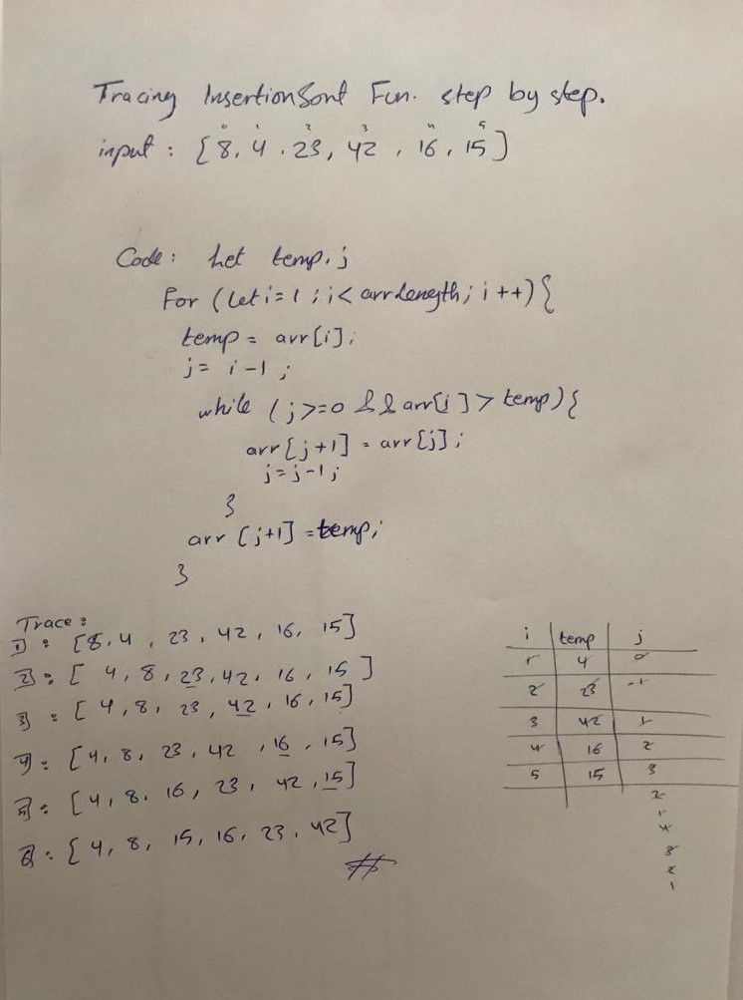

# Blog

**Insertion sort** is a sorting algorithm that places an unsorted element at its suitable place in each iteration. Insertion sort works similarly as we sort cards in our hand in a card game. We assume that the first card is already sorted then, we select an unsorted card.

[Home](./README.md)