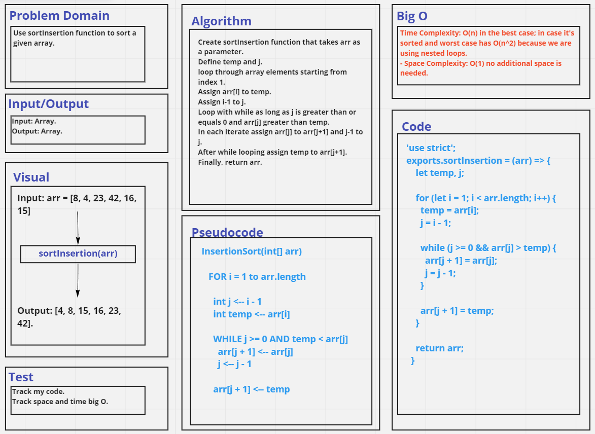

# Challenge Summary
Trace the insertion sort algo by stepping through the process with the provided sample array `[8,4,23,42,16,15]`. Document your explanation by creating a blog article that shows the step-by-step output after each iteration through some sort of visual.
Once you are done with your article, code a working, tested implementation of Insertion Sort based on the pseudocode provided.

## Whiteboard Process

## Approach & Efficiency
- Time Complexity: O(n) in the best case; in case it's sorted and worst case has O(n^2) because we are using nested loops. 
- Space Complexity: O(1) no additional space is needed. 

## Solution
See [sorting-insertion.test](./__tests__/sorting-insertion.test.js) file.

See [Blog File](./BLOG.md)