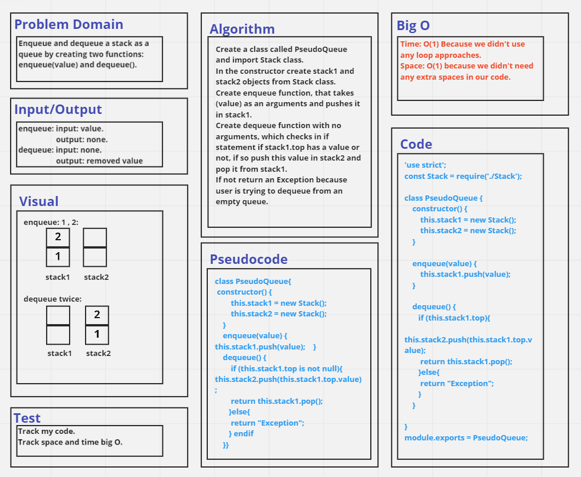

# Challenge Summary
Enqueue and dequeue a stack as a queue by creating two functions: `enqueue(value)` and `dequeue()`.

## Whiteboard Process

## Approach & Efficiency
Time: O(1) Because we didn't use any loop approaches.
Space: O(1) because we didn't need any extra spaces in our code.

## Solution
See [PseudoQueue.test](./__tests__/PseudoQueue.test.js) file.