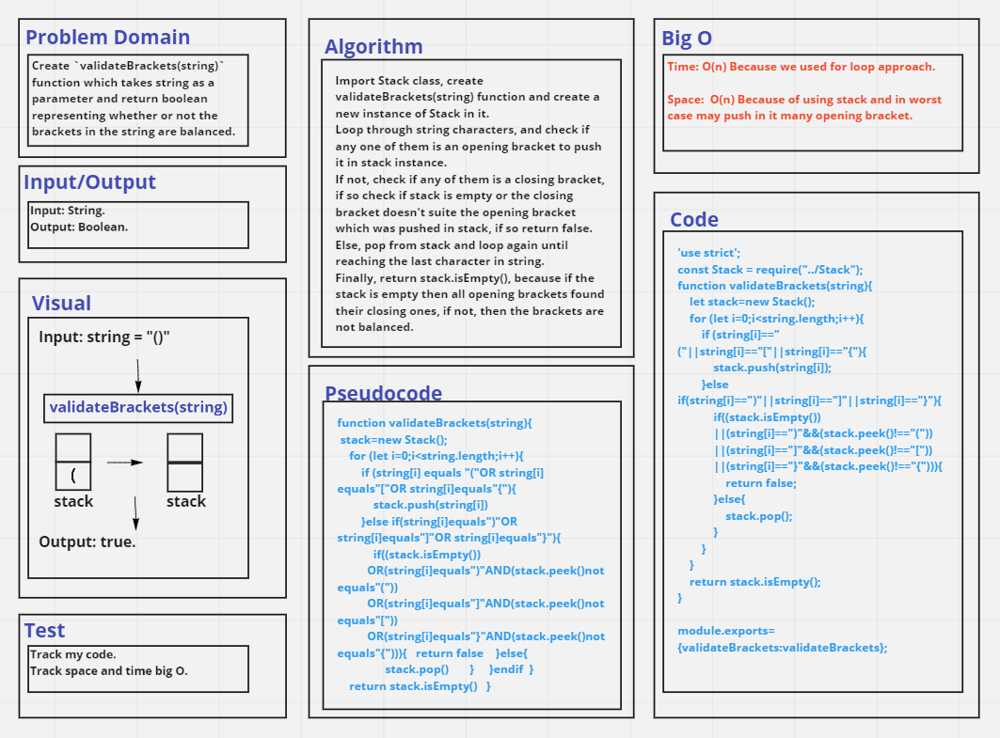

# Challenge Summary
Create `validateBrackets(string)` function which takes string as a parameter and return boolean representing whether or not the brackets in the string are balanced.

## Whiteboard Process

## Approach & Efficiency
Time: O(n) Because we used for loop approach.
Space: O(n) Because of using stack and in worst case may push in it many opening brackets.

## Solution
See [validateBrackets.test](./__tests__/validateBrackets.test.js) file.