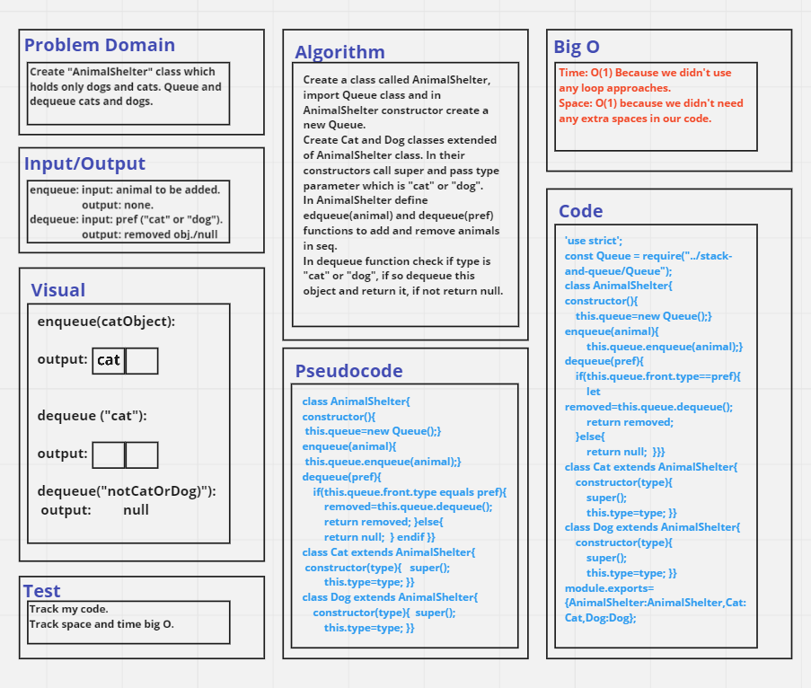

# Challenge Summary
Create "AnimalShelter" class which holds only dogs and cats. Queue and dequeue cats and dogs by `enqueue(animal)` and `dequeue(pref)` functions.

## Whiteboard Process

## Approach & Efficiency
Time: O(1) Because we didn't use any loop approaches.
Space: O(1) because we didn't need any extra spaces in our code.

## Solution
See [stack-queue-animal-shelter.test](./__tests__/stack-queue-animal-shelter.test.js) file.