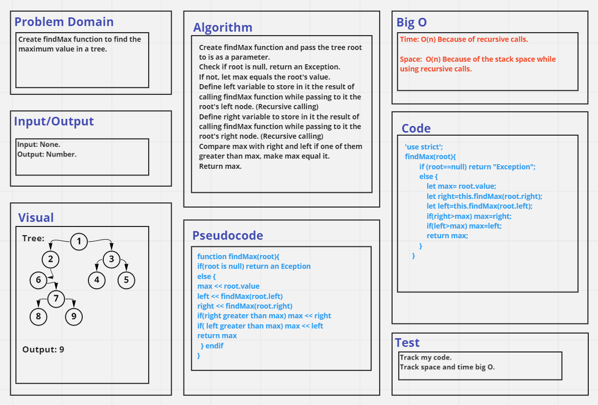

# Challenge Summary
Find the maximum value in a tree. 

## Whiteboard Process

## Approach & Efficiency
Time Comlexity is O(n) because of recursive calls.
Space Complexity is O(n) because of the stack space while using recursive calls.

## Solution
See [trees.test](./__tests__/trees.test.js) file.
