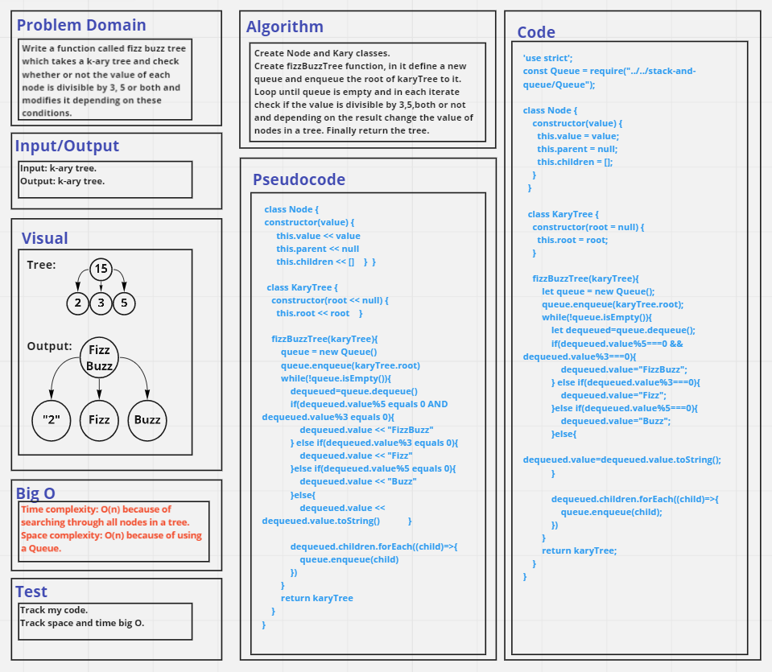

# Challenge Summary
Write a function called fizz buzz tree which takes a k-ary tree and check whether or not the value of each node is divisible by 3, 5 or both and modifies it depending on these conditions.

## Whiteboard Process

## Approach & Efficiency
- Time complexity: O(n) because of searching through all nodes in a tree.
- Space complexity: O(n) because of using a Queue.

## Solution
See [k-ary.test](./__tests__/k-ary.test.js) file.
