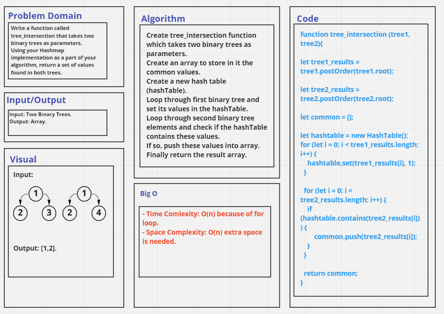

# Challenge Summary

Write a function called tree_intersection that takes two binary trees as parameters.

Using your Hashmap implementation as a part of your algorithm, return a set of values found in both trees.

- Arguments: Two Binary Trees.
- Return: Array.

## Whiteboard Process

## Approach & Efficiency
- Time Comlexity: O(n) because of for loop.
- Space Complexity: O(n) extra space is needed.

## Solution
See [tree_intersection.test file](./__tests__/tree_intersection.test.js).